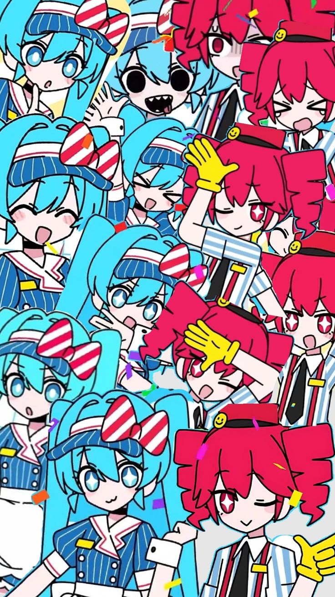

# mesmerizer

<p align="center">
  
</p>

CTF skill accumulator + nvim friction reducer. A multi-provider AI workflow CLI
(`mes`) tuned for terminal Claude Code / Codex, plus a Neovim integration that
trims the friction out of solving and note-taking.

**Status:** v0a in progress (foundation + CLI verbs + Teto-nvim).

## What it does

- **Skill accumulator** — capture and reuse CTF solve patterns instead of
  re-deriving them each time.
- **Provider-agnostic AI calls** — drive Claude / Codex from the terminal with
  reusable prompt templates.
- **Neovim friction reducer** — convert, decode, and sync directly from the
  buffer (`:MesConv`, live diff highlighting) without leaving the editor.

## CLI (`mes`)

| Command | Purpose |
| --- | --- |
| `mes pack <file:lines>` | Pack a file:lines selection into token-efficient markdown context |
| `mes ask` | Ask a question to an AI provider, with optional template |
| `mes decode [text]` | Decode + classify text (hex / base64 / url / addr) with auto-chaining |
| `mes conv <op> [input]` | Explicit CTF conversions: `l2b`, `b2l`, `h2b`, `b2h`, `bin`, `b32d` |
| `mes scaffold <category>` | Scaffold a CTF solve template into the current directory |
| `mes teto <cmd>` | Teto environment reference management (`setup` / `check` / `doctor` / `repair`) |

## Build

```sh
cargo build --release   # binary at target/release/mes
```
